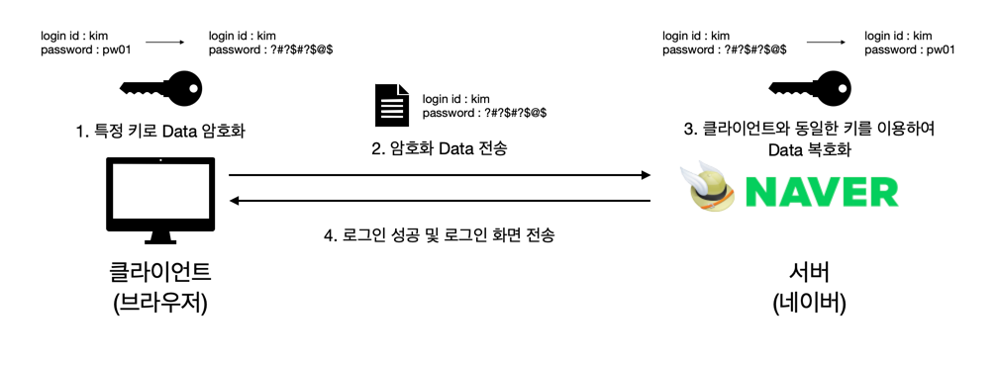
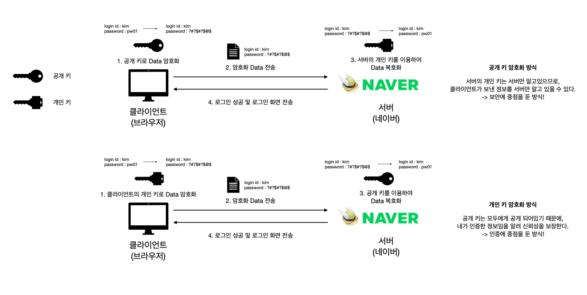
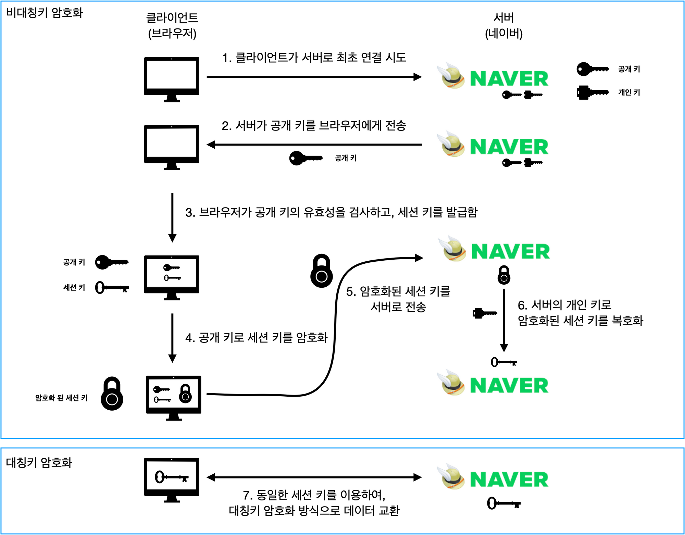
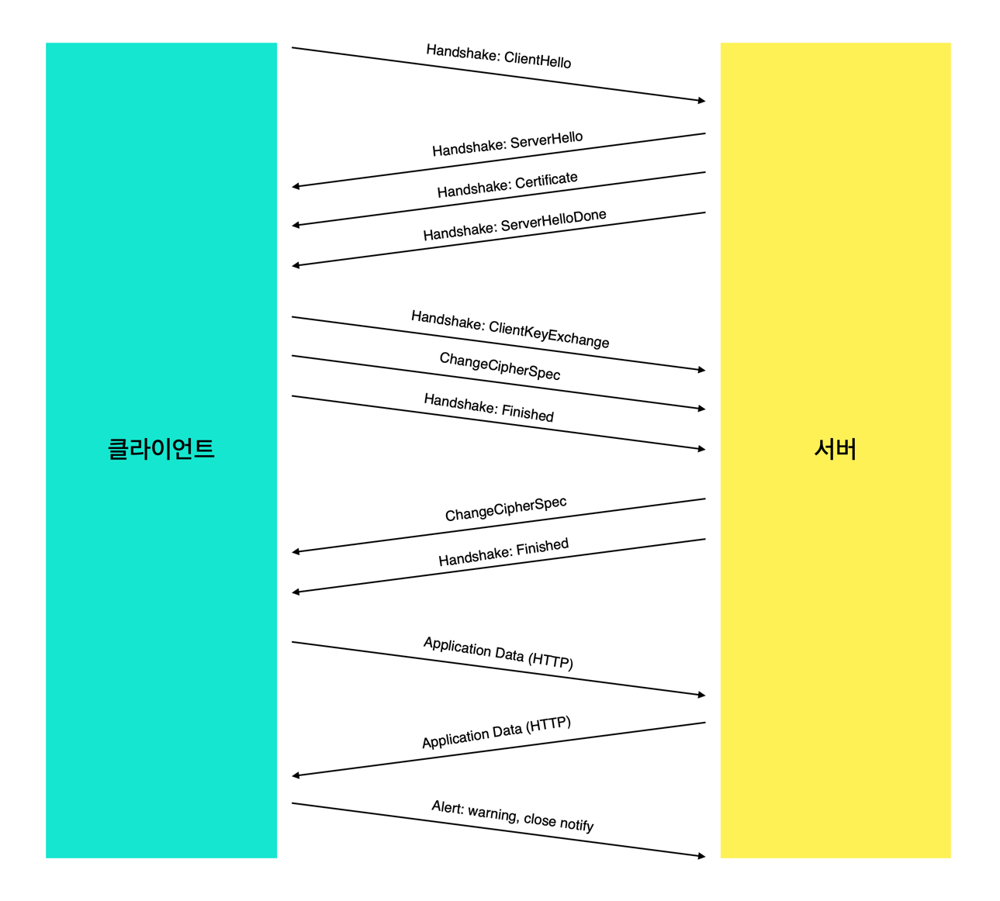

# 07. 웹을 안전하게 지켜주는 HTTPS
## 1. HTTP의 약점 
> - 암호화되지 않은 평문 통신 -> 도청 가능
> - 통신 상대를 확인하지 않음 -> 위장 가능
> - 완전성을 증명할 수 없음 -> 변조 가능 

### 도청 가능성 
HTTP는 자신을 암호화 하는 기능이 없음
- 통신 전체가 암호화 되지 않아 평문으로 HTTP 메시지 전송

#### TCP/IP는 도청 가능한 네트워크
- 암호화가 되어있지 않은 경우, TCP/IP 구조의 통신 내용은 통신 경로의 도중에 엿볼 수 있다.
- 네트워크 상에 흐르고 있는 패킷을 수집하는 것만으로 도청이 된다.
  - 패킷 캡처 : 대표적으로 Wireshark가 있다.
  - 스니퍼 

#### 암호화로 도청 피하기
1. 통신 암호화
   - HTTP에는 암호화 구조가 없기 때문에, 다른 프로토콜을 조합하여 통신 내용을 암호화함  
     - SSL(Secure Socket Layer) : 안전한 통신로 확립 -> 통신로 를 사용해 HTTP 통신 -> `HTTPS` 
     - TLS(Transport Layer Security) 
2. 콘텐츠 암호화
   - HTTP 메시지에 포함되는 내용을 암호화하는 것

 

### 위장 가능성
HTTP는 통신 상대를 확인하지 않기 때문에 클라이언트와 서버가 서로를 모른다.

#### 누구나 리퀘스트 할 수 있다
- 액세스 제한이 없는 경우, 누구든지 요청을 보내고 상대가 누구든지 응답을 해줌 
- 문제점
  - 요청을 보낸 곳의 웹 서버가 의도한 웹서버인지, 위장한 웹서버인지 분간할 수 없다.
  - 응답을 보낸 곳의 클라이언트가 원래 요청을 보낸 클라이언트인지, 위장한 클라이언트인지 알 수 없다.
  - 통신 상대가 접근이 허가된 대상인지 아닌지 확인할 수 없다.
  - 어디의 누가 요청을 보냈는지 확인할 수 없다.
  - 의미없는 요청도 수신할 수 있기 때문에, 대량의 요청에 의한 Ddos 공격을 방지할 수 없다.

#### 상대를 확인하는 증명서 
- HTTP는 통신 상대를 확인할 수 없다.
  - 하지만, SSL을 이용해서 상대를 확인할 수 있다.
- SSL은 **암호화** 뿐만 아니라, **상대를 확인하는 수단**으로 증명서를 제공한다.
  - 해당 증명서는 신뢰할 수 있는 제 3자 기관에 의해 발행된다.
  - 이는 서버나 클라이언트가 실재하는 사실을 증명한다.  
  - 증명서 위조는 기술적으로 상당히 어렵다.
  - 통신 상대의 서버나 클라이언트가 가진 증명서를 확인 -> 상대가 내가 통신하고자 하는 상대인지 여부 판단
  - 해당 증명서를 이용하여 통신 상대가 내가 통신하고자 하는 서버임을 나타냄 -> 이용자의 개인 정보 누설 등의 위험성 감소 
```mermaid
flowchart LR
Client-->|1. 서버의 증명서 확인|A[신뢰할 수 있는 제3자]
A-->|2. 해당 웹 사이트의 서버가 맞다는 증명|Client
```

 

### 변조 가능성 
- 완전성이란 **정보의 정확성**을 의미함.
  - 완전성을 증명할 수 없음 == 정보가 정확한지 아닌지 확인할 수 없음 
- HTTP는 완전성을 증명할 수 없기 때문에 변조가 가능하다는 취약점이 있다.

#### 수신한 내용이 다를 수도 있다 
- HTTP는 요청이나 응답이 발신된 후 상대가 수신하기 전에 변조되었다고 하더라도 사실을 알 수 없음.
  - 즉, 발신된 요청/응답 == 수신된 요청/응답 보장 불가
  - 중간에 변조하는 공격 : 중간자 공격(Man-in-the-Middle)

#### 변조를 방지하기 위한 방안 
- 자주 사용되는 방법
  - MD5, SHA-1 등의 해시 값을 확인 
  - 파일의 디지털 서명 확인 
- 하지만 위 방법으로 확실히 확인할 수 있는 것은 아님 
  - 위 값들이 적절히 수정되어 있다면 확인 불가 
> 확실하게 방지하기 위해서는 HTTPS를 사용하자.
> - SSL에는 인증이나 암호화, 다이제스트 기능을 제공한다.
> - HTTP만으로는 완전성 보증이 어려우므로 다른 프로토콜을 조합함으로써 실현하자. 

 
 

## 2. HTTP + 암호화 + 인증 + 완전성 보호 = HTTPS
### HTTPS(HTTP Secure)
- HTTPS = HTTP + 암호화 + 인증(증명서) + 완전성 보호
```mermaid
flowchart LR
A[Client + 증명서]-->|HTTP + 암호화 + 증명서 + 완전성 보호|B[Server + 증명서]
```

 

### HTTPS는 SSL 껍질을 덮어쓴 HTTP

- HTTPS는 HTTP 통신을 하는 부분을 SSL(Secure Socket Layer)나 TLS(Transport Layer Security)이라는 프로토콜로 대체한다.
  - SSL이 없는 HTTP
    - 직접 TCP와 통신
  - SSL이 있는 HTTP
    - SSL과 통신 -> SSL이 TCP와 통신   

- SSL을 사용함으로써 HTTP는 
  - 암호화를 사용할 수 있다
  - 증명서를 이용할 수 있다
  - 완전성 보호를 이용할 수 있다   

- SSL은 HTTP와는 독립된 프로토콜이다 
  - 애플리케이션 계층에서 동작하는 SMTP나 Telnet 등에서도 이용될 수 있다.
  - 널리 이용되는 기술 

 

### 상호간 키를 교환하는 공개키 암호화 방식 
- SSL은 공개키 암호화 방식을 채용한다. 
  - 암호의 알고리즘은 공개되어 있다.
    - 키를 비밀에 부침으로써 안전성을 유지  
    - 암호화 하거나 복호화 할 때 키를 사용 
  - 키가 없으면 암호 못품 
    - 반대로 키가 있으면 누구나 쉽게 품 

  

#### 공통키 암호화 방식
- 암호화와 복호화에 하나의 키를 같이 사용하는 방식
- 공통키 암호화는 상대방에게 키를 넘겨줘야 함 
- 문제점
  - 키를 넘겨줄 때 통신 도청 -> 공격자에게 키를 빼앗기면 끝 
  - 받은 키를 안전하게 보관하기 위한 노력 필요 

이는 "대칭키 암호화"라고도 불립니다. 아래와 같이 동작합니다.

 

#### 두 개의 키를 사용하는 공개키 암호화 방식  
- 서로 다른 두 개의 키 페어 사용 
  - 비밀 키(private key) 
  - 공개 키(public key)   
- 암호화 및 복호화 방법
  - 암호를 보내는 측이 공개 키를 이용해 암호화
  - 암호화된 정보를 받는 쪽이 비밀 키를 이용해 복호화   
- 비밀 키를 통신으로 보낼 일이 없어 빼앗길 걱정은 없음 

이는 "비대칭키 암호화"라고도 불립니다. 아래와 같이 동작합니다. 

 

#### HTTP는 하이브리드 암호 시스템이다 
- 공통키(대칭키) 암호화 + 공개키(비대칭키) 암호화 
  - 공개키 암호화 방식은 공통키 방식에 비해 처리 속도가 느리다.
  - 안전성과 속도 두가지 측면을 모두 잡기 위해 하이브리드로 사용함   
- 키를 교환하는 곳 -> 공개키 암호 사용
- 그 후의 통신 -> 공통키 암호 사용 

 

### 공개키가 정확한지 아닌지를 증명하는 증명서 
- 공개키 암호의 문제점
  - 공개키가 진짜인지 아닌지 증명할 수 없음 
- 인증 기관(CA: Certificate Authority)에서 발행하는 공개키 증명서 이용 
  - 클라이언트와 서버가 신뢰하는 제 3자 기관 
  - VeriSign이 대표적임. 아마존도 해주는걸로 알고있음 
- 공개키 증명서 = 서버의 공개키 + 인증 기관의 디지털 서명 

```mermaid
flowchart LR
A[Server]-->|1. 공개키를 인증기관에 등록|B[인증 기관]
B-->|2. 인증 기관의 비밀키로 서버의 공개키에 \n 디지털 서명으로 공개키 증명서를 작성 및 등록|A
A-->|3. 서버의 공개키 증명서 입수 \n 브라우저 내에 저장된 인증기관의 공개키로 디지털 서명을 검증|C[Client]
C-->|4. 서버의 공개 키로 암호화 해서 메시지를 송신 기관에 등록|A
```

- 인증 기관의 공개키는 브라우저가 사전에 내장한 상태로 제품을 내놓는다.

 

#### 조직의 실제성을 증명하는 EV SSL 증명서 
- 상대방이 실제로 있는 기업인지를 확인하는 증명서 
- 세계 표준의 인정 가이드라인에 의해서 발행됨 
- 브라우저의 주소창의 색이 녹색으로 변하면 EV SSL로 인증된 웹사이트임 

 

#### 클라이언트를 확인하는 클라이언트 증명서 
- 서버가 통신하고 있는 상대가 의도한 클라이언트인 것을 증명하는 증명서   
- 문제점 
  - 증명서의 입수와 배포 
  - 유저가 클라이언트 증명서를 인스톨 해야 함 
  - 유료임 -> 유저 수만큼 비용 지불 
  - 여러 유저가 인스톨해야 함 
  - 안전성이 매우 높지만 특정 용도로만 사용되는 중
  - 어디까지나 클라이언트의 실재를 증명할 뿐. 사용자의 존재 유무는 모름.
  - 클라이언트 증명서가 들어간 컴퓨터 -> 누구든지 증명서 이용 가능   
- 예시 "은행"
  - 로그인할 때 ID/PW 뿐만 아니라 클라이언트 증명서를 요구할 수 있음 
  - 특정 단말기에서 액세스하는지에 대한 여부를 확인 

 

#### 인증기관은 신용이 제일 
- 2011.07 네덜란드의 DigiNotar 사건
  - 인증기관이 잘못 액세스 -> `google.com`이나 `twitter.com` 등의 가짜 증명서 발행 
  - SSL 신뢰의 근본이 흔들리는 사건 
  - 잘못 발행되어도, 믿을 수 있는 인증 기관의 서명이 있기 때문에 브라우저는 올바른 증명서로 인식함 
  - 유저가 알아채기 어려움  
- 증명서를 무효화하는 증명서 취소 리스트(CRL)라는 구조나 루트 인증 기관을 클라이언트에게서 삭제하는 대책이 있긴 함 
  - 하지만 효과를 발휘할 때 까지 시간이 걸림
  - 얼마나 피해입을지 아무도 모름 

 

#### 자기 인증 기관 발행 증명서는 "나야 나" 증명서 
- OpenSSL
  - 누구나 인증 기관 구축 가능 -> 서버 증명서 발행 
  - 해당 서버 증명서는 인터넷 상에서 증명서 구실 X -> 쓸모 없음   
- 독자적으로 구축한 인증 기관을 "자기 인증 기관"이라고 함
  - 해당 기관에서 발행한 쓸모없는 증명서를 비하하여 "나야 나 증명서"라고 부름 
  - 경고 메세지가 표시 됨 
    - 접속의 안전성 확인할 수 없음 
    - 이 사이트의 보안 증명서에 문제가 있음   
- 위장의 가능성
- 안전하지 않음 

 

#### 마이너 인증 기관을 이용하면 "나야 나"증명서가 될 수도 있다 
- 브라우저에 따라 다르게 적용 됨 

 

### 안전한 통신을 하는 HTTPS의 구조

1. 클라이언트가 Client Hello 메세지 송신하면서 SSL 통신 시작
   - 메시지에는 아래와 같은 것들이 포함되어 있음
     - 클라이언트가 제공하는 SSL 버전 지정 
     - Cipher Suite(암호 스위트)라고 불리는 리스트 (사용하는 암호화의 알고리즘이나 키 사이즈 등이 포함됨)  
2. 서버가 SSL 통신이 가능한 경우 Server Hello 메시지로 응답 
   - SSL 버전, 암호 스위트 포함 
   - 서버의 암호 스위트 내용은 클라이언트에서 받은 내용에서 선택된 것임   
3. 서버가 Certificate 메시지 전송 
   - 메시지에는 공개키 증명서가 포함되어 있음  
4. 서버가 Server Hello Done 메시지 송신
   - 최초의 SSL 네고시에이션 부분이 끝났음을 통지   
5. SSL 최초 네고시에이션이 종료되면 클라이언트가 Client Key Exchange 메시지 응답 
   - 통신을 암호화하는 데 사용하는 Pre-Master secret이 포함되어 있음 
   - 해당 메시지는 3번의 공개키 증명서에서 꺼낸 공개키로 암호화 되어있음  
6. 클라이언트가 Change Cipher Spec 메시지 송신 
   - 이 메시지 이후의 통신은 암호키를 사용해서 진행한다는 것을 나타냄  
7. 클라이언트가 Finished 메시지 송신 
   - 접속 전체의 체크 값을 포함하고 있음 
   - 네고시에이션이 성공했는지에 대한 여부는 서버가 해당 메시지를 올바르게 복호화할 수 있는지 아닌지가 결정함   
8. 서버에서 Change Cipher Spec 메시지 송신   
9. 서버에서 Finished 메시지 송신   
10. 서버와 클라이언트 간 Finished 메시지 교환이 완료될 경우 SSL에 의해서 접속이 확립 됨 
    - 통신은 SSL에 의해 보호됨 
    - 애플리케이션 계층의 프로토콜에 의해 통신 함 
    - HTTP 리퀘스트 송신   
11. 애플리케이션 계층의 프로토콜에 의한 통신
    - HTTP 리스폰스 송신   
12. 마지막에 클라이언트가 접속을 끊음 
    - close_notify 메시지 송신 
    - 그 후 TCP FIN 메시지 보내 TCP 통신 종료   

- 이 흐름에 더해, 애플리케이션 계층의 데이터를 송신할 때는 MAC(Message Authentication Code)이라고 불리는 메시지 다이제스트를 덧붙일 수 있음 
  - 이를 이용해서 변조를 감지할 수 있기 때문에 완전성 보호 실현 가능 

위 흐름을 아래의 그림으로 표현할 수 있음. (이 그림이 위에 설명한 비대칭키 통신 방법과 동일하나, 더 어려움)

 

#### SSL과 TLS
- SSL
  - 넷스케이프 커뮤니케이션스사가 내놓은 프로토콜 (3.0까지)
  - 현재는 IETF로 옮겨짐 
- TLS
  - SSL3.0을 기반으로 한 TLS1.0 ~
  - SSL을 바탕으로 한 프로토콜이나, 이를 총칭해서 SSL이라고 부르기도 함 
  - 현재는 SSL3.0, TLS1.0이 주류임 

 

#### SSL은 느리다??
- HTTPS의 문제
  - SSL을 쓰면 느려진다 
  - SSL 통신만큼 네트워크 리소스를 더 소비함 
  - 서버, 클라이언트 모두 암호화 및 복호화 처리가 필요하기 때문에 CPU, 메모리 등 하드웨어 리소스를 소비 
- 느려지는 것에 대한 근본적인 해결책은 없다 
  - SSL 엑셀러레이터라는 하드웨어를 사용해서 이 문제를 해결하기도 함 
  - SSL을 처리하기 위한 전용 하드웨어. 소프트웨어로 처리할 때 보다 몇 배 빠른 계산 가능.
  - SSL만 처리하도록 함으로써 부하 분산 

